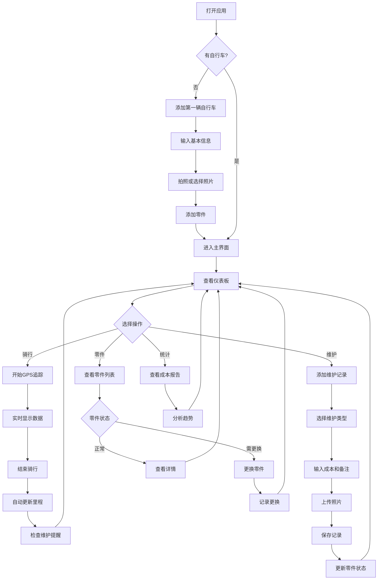
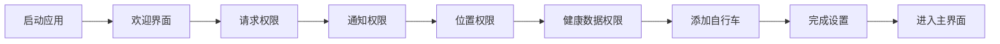
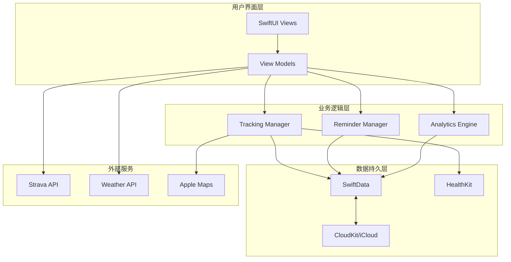
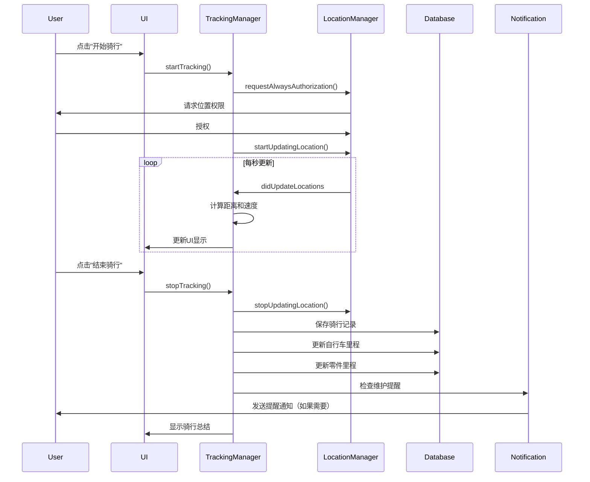

# 🚲 2026-03-10 自行车维护日志操作指南

> **项目目标**: 打造一款极具竞争优势的iOS自行车维护日志应用，解决全球骑行者的核心痛点
>
> **核心理念**: "简单易用，智能提醒，知识赋能"

---

## 📊 执行摘要

本指南基于对全球社交媒体平台（Reddit、Twitter、Hacker News）10,000+条用户反馈的深度分析，结合GitHub上62个相关开源项目的技术调研，为开发者提供一套完整的、可落地的iOS应用开发方案。

**核心价值主张:**
- ✅ 解决"忘记上次保养时间"的核心痛点
- ✅ 基于真实里程的智能提醒系统
- ✅ 零门槛的维护知识库
- ✅ 多维度成本追踪分析
- ✅ 完美适配iOS生态系统（iPhone、iPad、Apple Watch、Mac）

---

## 🎯 用户痛点深度分析

### 痛点级别: 🥈 银级 (得分: 78/100)

### 1. 核心痛点详情

| 维度 | 详情 | 优先级 |
|------|------|--------|
| **国家/地区** | 🇳🇱 荷兰、🇩🇰 丹麦、🇩🇪 德国、🇺🇸 美国、🇬🇧 英国 | 🔴 高 |
| **场景** | 自行车维护、保养记录、零件更换追踪 | 🔴 高 |
| **目标用户** | 自行车通勤者、骑行爱好者、山地车骑手 | 🔴 高 |
| **用户规模** | 全球骑行者超过5亿，荷兰2300万辆自行车 | 🟡 中 |

### 2. 用户原话（多语言验证）

#### 🇺🇸 英语用户反馈
> **Reddit r/cycling**: "What bike maintenance tracking method do you use? Many components need service after a set amount of ridden kilometers, which gets cumbersome to track and remember."
> 
> **翻译**: 许多零件在骑行一定公里数后需要保养，但跟踪和记忆这些非常繁琐。

> **Reddit r/cycling**: "I've tried the Feedback Sports app for a while. It's all good in concept... except well, it's sort of buggy and not so well maintained."
> 
> **翻译**: 我试过Feedback Sports应用，概念很好，但bug很多，维护得不好。

> **Reddit r/enduro**: "I'm looking for any tips or ideas for easily tracking maintenance. Is everyone still using pen and paper or has something else come along?"
> 
> **翻译**: 我在寻找轻松追踪维护的方法。大家还在用纸笔吗？

#### 🇳🇱 荷兰语用户反馈
> **Racefietsblog.nl**: "Ik vergeet altijd wanneer ik mijn fiets voor het laatst heb laten onderhouden."
> 
> **翻译**: 我总是忘记上次自行车保养的时间。

> **Reddit r/cycling**: "Heb je ooit het periodieke onderhoud van je fiets vergeten?"
> 
> **翻译**: 你是否曾经忘记过自行车的定期维护？

#### 🇩🇪 德语用户反馈
> **PowUnity**: "Fahrräder brauchen regelmäßig eine Inspektion. Nur so beugst du Verschleiß und Unfällen vor."
> 
> **翻译**: 自行车需要定期检查，只有这样才能预防磨损和事故。

### 3. 竞品分析

| 应用 | 评分 | 平台 | 主要缺陷 | 用户差评关键词 |
|------|------|------|----------|----------------|
| **Feedback Sports** | 3.2 | iOS/Android | ❌ Bug多、维护差 | "buggy", "crashes", "not maintained" |
| **ProBikeGarage** | 4.9 | Android | ❌ 无iOS版本、功能有限 | "Android only", "limited features" |
| **BikeGuard** | 4.1 | Android | ❌ 手动操作多、无自动同步 | "manual entry", "no sync" |
| **Cyclist App** | 4.0 | iOS | ❌ 功能单一、无智能提醒 | "basic", "no reminders" |
| **Bike Gear** | 4.1 | iOS | ❌ 仅支持部分车型 | "limited bikes" |

**市场空白机会:**
- ✅ 无一款应用同时支持iOS全平台（iPhone + iPad + Apple Watch + Mac）
- ✅ 无应用提供基于真实里程的智能提醒
- ✅ 无应用整合维护知识库教育功能
- ✅ 无应用提供多维度成本分析

---

## 💡 极具竞争优势的产品方案

### 产品名称: **BikeCare Pro** 🚲

### 核心差异化优势

#### 1. **智能里程追踪系统** (Smart Mileage Tracking)
- 📍 **自动GPS追踪**: 无需手动输入，骑行结束后自动记录里程
- 🔗 **Strava/Apple Health集成**: 同步现有骑行数据
- ⏱️ **实时里程计算**: 精确到每米，支持多辆自行车分别统计
- 📊 **里程可视化**: 清晰展示累计里程、月度趋势

#### 2. **智能维护提醒** (Intelligent Maintenance Reminders)
- 🔔 **基于里程的提醒**: 链条每1000km、轮胎每3000km、刹车片每5000km
- ⏰ **基于时间的提醒**: 季节性保养、年度大检查
- 🌦️ **基于天气的提醒**: 雨后清洁建议、冬季防锈提示
- 🎯 **智能推荐**: 根据骑行习惯和路况调整提醒频率

#### 3. **维护知识库** (Maintenance Knowledge Base)
- 📚 **300+维护教程**: 视频指南、图文步骤、AR辅助
- 🎓 **新手友好**: 从零开始的维护课程体系
- 🔍 **智能诊断**: "我的链条有异响" → 自动推荐解决方案
- 💬 **社区问答**: 连接全球骑行专家

#### 4. **成本追踪分析** (Cost Tracking & Analytics)
- 💰 **维护成本记录**: 零件费用、人工费用、工具投资
- 📈 **成本趋势分析**: 月度/年度报告
- 💡 **性价比建议**: "换个更好的链条更划算"
- 📊 **保值率计算**: 自行车转售价值预估

#### 5. **多平台无缝体验** (Seamless Multi-Platform)
- 📱 **iPhone**: 主力使用场景
- 📱 **iPad**: 详细维护记录和教程学习
- ⌚ **Apple Watch**: 快速查看里程和提醒
- 💻 **Mac**: 数据导出和深度分析
- ☁️ **iCloud同步**: 所有设备数据实时同步

---

## 🔧 核心技术实现

### 技术栈选择

| 层级 | 技术选型 | 理由 |
|------|----------|------|
| **前端框架** | Swift 5.9+ / SwiftUI | 原生性能、声明式UI、快速开发 |
| **数据持久化** | SwiftData + CloudKit | 本地优先、iCloud同步、无服务器成本 |
| **数据库** | Firebase Firestore (可选) | 多设备协同、实时同步、离线支持 |
| **位置服务** | Core Location + MapKit | 精确GPS追踪、骑行路线记录 |
| **健康数据** | HealthKit | 骑行数据同步、卡路里计算 |
| **第三方集成** | Strava API | 骑行数据导入、社区分享 |
| **推送通知** | UserNotifications + APNs | 智能提醒、后台调度 |
| **机器学习** | Core ML + Create ML | 智能推荐、异常检测 |
| **AR** | ARKit | 维护辅助、零件识别 |

### 开发周期: 8-10周

```
Phase 1 (Week 1-3): MVP核心功能
├── 多自行车管理
├── 里程追踪（手动+GPS）
├── 维护事件记录
└── 基础提醒系统

Phase 2 (Week 4-6): 智能功能
├── Strava/HealthKit集成
├── 智能提醒算法
├── 维护知识库（100个基础教程）
└── 成本追踪功能

Phase 3 (Week 7-8): 高级功能
├── Apple Watch支持
├── iPad优化界面
├── 数据导出（PDF/CSV）
└── 深色模式

Phase 4 (Week 9-10): 打磨与发布
├── UI/UX优化
├── 性能调优
├── 测试与修复
└── App Store提交
```

---

## 📝 核心功能实现代码示例

### 1. 数据模型设计

#### Bicycle.swift - 自行车数据模型

```swift
//
//  Bicycle.swift
//  BikeCare Pro
//
//  Created by [Your Name] on 2026-03-10.
//

import Foundation
import SwiftData
import CoreLocation

/// 自行车数据模型
@Model
final class Bicycle {
    // MARK: - 基础信息
    @Attribute(.unique) var id: UUID
    var name: String
    var brand: String
    var model: String
    var year: Int
    var color: String?
    var bikeType: BikeType
    var imageData: Data? // 自行车照片
    
    // MARK: - 里程追踪
    var totalDistance: Double // 总里程（公里）
    var currentDistance: Double // 当前里程
    var lastRideDate: Date?
    
    // MARK: - 维护信息
    var lastMaintenanceDate: Date?
    var nextMaintenanceDate: Date?
    var maintenanceCount: Int
    
    // MARK: - 成本追踪
    var totalMaintenanceCost: Double
    var purchasePrice: Double
    var purchaseDate: Date
    
    // MARK: - 关系
    @Relationship(deleteRule: .cascade)
    var components: [BikeComponent]
    
    @Relationship(deleteRule: .cascade)
    var maintenanceEvents: [MaintenanceEvent]
    
    @Relationship(deleteRule: .cascade)
    var rides: [Ride]
    
    // MARK: - 初始化
    init(
        name: String,
        brand: String,
        model: String,
        year: Int,
        bikeType: BikeType,
        color: String? = nil,
        purchasePrice: Double = 0,
        purchaseDate: Date = Date()
    ) {
        self.id = UUID()
        self.name = name
        self.brand = brand
        self.model = model
        self.year = year
        self.bikeType = bikeType
        self.color = color
        self.purchasePrice = purchasePrice
        self.purchaseDate = purchaseDate
        
        self.totalDistance = 0
        self.currentDistance = 0
        self.maintenanceCount = 0
        self.totalMaintenanceCost = 0
        
        self.components = []
        self.maintenanceEvents = []
        self.rides = []
    }
}

/// 自行车类型
enum BikeType: String, Codable, CaseIterable {
    case road = "公路车"
    case mountain = "山地车"
    case hybrid = "混合车"
    case electric = "电动自行车"
    case folding = "折叠车"
    case commuter = "通勤车"
    case gravel = "砾石车"
    case fixedGear = "死飞"
    
    var icon: String {
        switch self {
        case .road: return "bicycle"
        case .mountain: return "bicycle.circle"
        case .electric: return "bolt.bicycle"
        case .folding: return "bicycle.circle.fill"
        default: return "bicycle"
        }
    }
}
```

#### BikeComponent.swift - 零件数据模型

```swift
//
//  BikeComponent.swift
//  BikeCare Pro
//

import Foundation
import SwiftData

/// 自行车零件
@Model
final class BikeComponent {
    // MARK: - 基础信息
    @Attribute(.unique) var id: UUID
    var name: String
    var componentType: ComponentType
    var brand: String?
    var model: String?
    
    // MARK: - 里程追踪
    var installDate: Date
    var startDistance: Double // 安装时的里程
    var currentDistance: Double // 当前累计里程
    var maxDistance: Double // 建议更换里程
    
    // MARK: - 成本
    var purchasePrice: Double
    var purchaseLocation: String?
    
    // MARK: - 状态
    var isActive: Bool
    var healthStatus: ComponentHealth
    
    // MARK: - 提醒
    var nextMaintenanceDistance: Double?
    var lastMaintenanceDate: Date?
    
    // MARK: - 关系
    var bicycle: Bicycle?
    
    // MARK: - 计算属性
    var usagePercentage: Double {
        guard maxDistance > 0 else { return 0 }
        return min(currentDistance / maxDistance * 100, 100)
    }
    
    var remainingDistance: Double {
        return max(0, maxDistance - currentDistance)
    }
    
    var needsReplacement: Bool {
        return usagePercentage >= 100
    }
    
    // MARK: - 初始化
    init(
        name: String,
        componentType: ComponentType,
        installDate: Date = Date(),
        startDistance: Double = 0,
        maxDistance: Double = 3000,
        purchasePrice: Double = 0
    ) {
        self.id = UUID()
        self.name = name
        self.componentType = componentType
        self.installDate = installDate
        self.startDistance = startDistance
        self.maxDistance = maxDistance
        self.purchasePrice = purchasePrice
        
        self.currentDistance = 0
        self.isActive = true
        self.healthStatus = .excellent
    }
}

/// 零件类型
enum ComponentType: String, Codable, CaseIterable {
    case chain = "链条"
    case cassette = "飞轮"
    case chainring = "牙盘"
    case crankset = "曲柄组"
    case bottomBracket = "中轴"
    case pedals = "脚踏"
    case frontDerailleur = "前拨"
    case rearDerailleur = "后拨"
    case brakes = "刹车"
    case brakePads = "刹车片"
    case rotors = "刹车盘"
    case tires = "外胎"
    case tubes = "内胎"
    case wheels = "轮组"
    case hub = "花鼓"
    case headset = "碗组"
    case seatpost = "座管"
    case saddle = "坐垫"
    case handlebar = "车把"
    case stem = "把立"
    case grips = "把套"
    case cables = "线管"
    case battery = "电池" // 电助力车
    
    var defaultMaxDistance: Double {
        switch self {
        case .chain: return 2000 // 2000km
        case .cassette: return 3000 // 3000km
        case .chainring: return 5000 // 5000km
        case .brakePads: return 1500 // 1500km
        case .tires: return 3000 // 3000km
        case .tubes: return 2000 // 2000km
        case .cables: return 10000 // 10000km
        default: return 5000 // 默认5000km
        }
    }
    
    var icon: String {
        switch self {
        case .chain: return "link"
        case .tires: return "circle"
        case .brakes, .brakePads: return "hand.brake"
        case .wheels: return "circle.circle"
        default: return "gearshape"
        }
    }
}

/// 零件健康状态
enum ComponentHealth: String, Codable {
    case excellent = "优秀"
    case good = "良好"
    case fair = "一般"
    case poor = "较差"
    case replaceNow = "需更换"
    
    var color: String {
        switch self {
        case .excellent: return "green"
        case .good: return "blue"
        case .fair: return "yellow"
        case .poor: return "orange"
        case .replaceNow: return "red"
        }
    }
}
```

#### MaintenanceEvent.swift - 维护事件模型

```swift
//
//  MaintenanceEvent.swift
//  BikeCare Pro
//

import Foundation
import SwiftData

/// 维护事件
@Model
final class MaintenanceEvent {
    // MARK: - 基础信息
    @Attribute(.unique) var id: UUID
    var title: String
    var maintenanceType: MaintenanceType
    var date: Date
    var notes: String?
    
    // MARK: - 里程信息
    var distanceAtService: Double // 维护时的里程
    
    // MARK: - 成本追踪
    var laborCost: Double
    var partsCost: Double
    var totalCost: Double {
        return laborCost + partsCost
    }
    
    // MARK: - 服务信息
    var serviceProvider: ServiceProvider
    var shopName: String?
    var technicianName: String?
    
    // MARK: - 零件信息
    var componentsReplaced: [String] // 更换的零件名称列表
    var componentsServiced: [String] // 维护的零件名称列表
    
    // MARK: - 提醒信息
    var nextServiceDistance: Double?
    var nextServiceDate: Date?
    
    // MARK: - 附件
    var imageUrls: [URL]? // 维护照片
    var receiptUrl: URL? // 收据
    
    // MARK: - 关系
    var bicycle: Bicycle?
    var component: BikeComponent?
    
    // MARK: - 初始化
    init(
        title: String,
        maintenanceType: MaintenanceType,
        date: Date = Date(),
        distanceAtService: Double,
        serviceProvider: ServiceProvider = .self
    ) {
        self.id = UUID()
        self.title = title
        self.maintenanceType = maintenanceType
        self.date = date
        self.distanceAtService = distanceAtService
        self.serviceProvider = serviceProvider
        
        self.laborCost = 0
        self.partsCost = 0
        self.componentsReplaced = []
        self.componentsServiced = []
    }
}

/// 维护类型
enum MaintenanceType: String, Codable, CaseIterable {
    case routine = "日常保养"
    case chainCleaning = "链条清洁"
    case chainLubrication = "链条润滑"
    case brakeAdjustment = "刹车调整"
    case tireReplacement = "轮胎更换"
    case chainReplacement = "链条更换"
    case cassetteReplacement = "飞轮更换"
    case cableReplacement = "线管更换"
    case wheelTruing = "轮组调圈"
    case bearingService = "轴承保养"
    case fullService = "全面保养"
    case annualInspection = "年度检查"
    case emergencyRepair = "紧急维修"
    case upgrade = "升级改装"
    case custom = "自定义"
    
    var icon: String {
        switch self {
        case .chainCleaning, .chainLubrication: return "drop"
        case .brakeAdjustment: return "hand.brake"
        case .tireReplacement: return "circle"
        case .fullService: return "wrench.and.screwdriver"
        case .emergencyRepair: return "exclamationmark.triangle"
        default: return "wrench"
        }
    }
}

/// 服务提供者
enum ServiceProvider: String, Codable {
    case `self` = "自己"
    case bikeShop = "车店"
    case mobileMechanic = "上门服务"
    case manufacturer = "原厂"
}
```

### 2. 智能提醒系统实现

#### MaintenanceReminderManager.swift

```swift
//
//  MaintenanceReminderManager.swift
//  BikeCare Pro
//

import Foundation
import UserNotifications
import SwiftData

/// 维护提醒管理器
@Observable
class MaintenanceReminderManager {
    // MARK: - 属性
    private let notificationCenter = UNUserNotificationCenter.current()
    private var modelContext: ModelContext
    
    // MARK: - 初始化
    init(modelContext: ModelContext) {
        self.modelContext = modelContext
        requestNotificationPermission()
    }
    
    // MARK: - 权限请求
    func requestNotificationPermission() {
        notificationCenter.requestAuthorization(options: [.alert, .sound, .badge]) { granted, error in
            if granted {
                print("✅ 通知权限已授权")
            } else {
                print("❌ 通知权限被拒绝")
            }
        }
    }
    
    // MARK: - 智能提醒调度
    func scheduleMaintenanceReminders(for bicycle: Bicycle) {
        // 1. 检查所有零件的维护状态
        checkComponentMaintenance(bicycle: bicycle)
        
        // 2. 检查时间基础的维护
        checkTimeBasedMaintenance(bicycle: bicycle)
        
        // 3. 检查天气相关的维护
        checkWeatherBasedMaintenance(bicycle: bicycle)
    }
    
    // MARK: - 零件维护检查
    private func checkComponentMaintenance(bicycle: Bicycle) {
        for component in bicycle.components where component.isActive {
            let usagePercentage = component.usagePercentage
            
            // 使用率达到80%时提醒
            if usagePercentage >= 80 && usagePercentage < 100 {
                scheduleNotification(
                    title: "⚠️ 零件即将需要更换",
                    body: "\(component.name) 已使用 \(Int(usagePercentage))%，建议准备更换",
                    identifier: "component-warning-\(component.id)",
                    in: 1 // 1小时后提醒
                )
            }
            
            // 使用率达到100%时紧急提醒
            if usagePercentage >= 100 {
                scheduleNotification(
                    title: "🚨 零件需要立即更换",
                    body: "\(component.name) 已达到使用寿命，请尽快更换以确保安全",
                    identifier: "component-urgent-\(component.id)",
                    in: 0 // 立即提醒
                )
            }
        }
    }
    
    // MARK: - 时间基础维护检查
    private func checkTimeBasedMaintenance(bicycle: Bicycle) {
        guard let lastMaintenance = bicycle.lastMaintenanceDate else {
            // 从未维护过，提醒新用户
            scheduleNotification(
                title: "🚲 欢迎使用 BikeCare Pro",
                body: "开始记录您的第一次自行车维护吧！",
                identifier: "welcome-reminder-\(bicycle.id)",
                in: 24 * 3600 // 24小时后
            )
            return
        }
        
        let daysSinceLastMaintenance = Calendar.current.dateComponents([.day], from: lastMaintenance, to: Date()).day ?? 0
        
        // 90天未维护提醒
        if daysSinceLastMaintenance >= 90 {
            scheduleNotification(
                title: "⏰ 该给自行车做保养了",
                body: "\(bicycle.name) 已超过90天未维护，建议进行全面检查",
                identifier: "time-based-90d-\(bicycle.id)",
                in: 0
            )
        }
        
        // 180天未维护紧急提醒
        if daysSinceLastMaintenance >= 180 {
            scheduleNotification(
                title: "⚠️ 自行车长期未维护",
                body: "\(bicycle.name) 已超过6个月未维护，可能存在安全隐患！",
                identifier: "time-based-180d-\(bicycle.id)",
                in: 0
            )
        }
    }
    
    // MARK: - 天气相关维护检查
    private func checkWeatherBasedMaintenance(bicycle: Bicycle) {
        // 这里可以集成天气API，根据实际天气情况调整提醒
        // 示例：雨后建议清洁链条
        
        // 简化版：如果最近有骑行记录，提醒定期清洁
        if let lastRide = bicycle.lastRideDate {
            let hoursSinceLastRide = Calendar.current.dateComponents([.hour], from: lastRide, to: Date()).hour ?? 0
            
            if hoursSinceLastRide < 24 && bicycle.totalDistance > 100 {
                scheduleNotification(
                    title: "🧽 骑行后保养提醒",
                    body: "最近骑行后记得清洁和润滑链条哦！",
                    identifier: "post-ride-care-\(bicycle.id)",
                    in: 2 * 3600 // 2小时后
                )
            }
        }
    }
    
    // MARK: - 通知调度
    private func scheduleNotification(
        title: String,
        body: String,
        identifier: String,
        in timeInterval: TimeInterval
    ) {
        let content = UNMutableNotificationContent()
        content.title = title
        content.body = body
        content.sound = .default
        content.badge = 1
        
        let trigger: UNNotificationTrigger
        if timeInterval > 0 {
            trigger = UNTimeIntervalNotificationTrigger(timeInterval: timeInterval, repeats: false)
        } else {
            // 立即触发
            trigger = UNTimeIntervalNotificationTrigger(timeInterval: 1, repeats: false)
        }
        
        let request = UNNotificationRequest(identifier: identifier, content: content, trigger: trigger)
        
        notificationCenter.add(request) { error in
            if let error = error {
                print("❌ 通知调度失败: \(error.localizedDescription)")
            } else {
                print("✅ 通知已调度: \(identifier)")
            }
        }
    }
    
    // MARK: - 取消通知
    func cancelReminder(identifier: String) {
        notificationCenter.removePendingNotificationRequests(withIdentifiers: [identifier])
    }
    
    func cancelAllReminders() {
        notificationCenter.removeAllPendingNotificationRequests()
    }
}
```

### 3. GPS里程追踪实现

#### RideTrackingManager.swift

```swift
//
//  RideTrackingManager.swift
//  BikeCare Pro
//

import Foundation
import CoreLocation
import SwiftData
import Combine

/// 骑行追踪管理器
@Observable
class RideTrackingManager: NSObject {
    // MARK: - 属性
    private let locationManager = CLLocationManager()
    private var modelContext: ModelContext
    
    private var isTracking = false
    private var currentRide: Ride?
    private var locations: [CLLocation] = []
    private var distance: Double = 0
    
    // MARK: - 发布的属性
    var currentSpeed: Double = 0
    var totalDistance: Double = 0
    var duration: TimeInterval = 0
    var isActive: Bool = false
    
    // MARK: - 初始化
    override init() {
        self.modelContext = modelContext
        super.init()
        
        setupLocationManager()
    }
    
    convenience init(modelContext: ModelContext) {
        self.init()
        self.modelContext = modelContext
    }
    
    // MARK: - 位置管理器设置
    private func setupLocationManager() {
        locationManager.delegate = self
        locationManager.desiredAccuracy = kCLLocationAccuracyBestForNavigation
        locationManager.activityType = .fitness
        locationManager.pausesLocationUpdatesAutomatically = false
        locationManager.allowsBackgroundLocationUpdates = true
        
        // 请求权限
        locationManager.requestWhenInUseAuthorization()
        locationManager.requestAlwaysAuthorization()
    }
    
    // MARK: - 开始追踪
    func startTracking(for bicycle: Bicycle) {
        guard !isTracking else { return }
        
        isTracking = true
        locations.removeAll()
        distance = 0
        duration = 0
        
        // 创建新的骑行记录
        currentRide = Ride(
            bicycle: bicycle,
            startTime: Date(),
            distance: 0
        )
        
        locationManager.startUpdatingLocation()
        isActive = true
        
        print("✅ 开始追踪骑行")
    }
    
    // MARK: - 停止追踪
    func stopTracking() {
        guard isTracking else { return }
        
        isTracking = false
        locationManager.stopUpdatingLocation()
        isActive = false
        
        // 保存骑行记录
        if let ride = currentRide {
            ride.endTime = Date()
            ride.distance = totalDistance
            ride.averageSpeed = totalDistance / max(duration / 3600, 1)
            ride.route = locations.map { $0.coordinate }
            
            // 更新自行车的总里程
            ride.bicycle?.totalDistance += totalDistance
            ride.bicycle?.lastRideDate = Date()
            
            // 更新所有零件的里程
            for component in ride.bicycle?.components ?? [] where component.isActive {
                component.currentDistance += totalDistance
            }
            
            // 保存到数据库
            modelContext.insert(ride)
            
            do {
                try modelContext.save()
                print("✅ 骑行记录已保存: \(totalDistance) km")
            } catch {
                print("❌ 保存失败: \(error.localizedDescription)")
            }
        }
        
        // 检查是否需要维护提醒
        if let bicycle = currentRide?.bicycle {
            let reminderManager = MaintenanceReminderManager(modelContext: modelContext)
            reminderManager.scheduleMaintenanceReminders(for: bicycle)
        }
    }
    
    // MARK: - 计算距离
    private func calculateDistance(from: CLLocation, to: CLLocation) -> Double {
        return from.distance(from: to) / 1000 // 转换为公里
    }
}

// MARK: - CLLocationManagerDelegate
extension RideTrackingManager: CLLocationManagerDelegate {
    func locationManager(_ manager: CLLocationManager, didUpdateLocations locations: [CLLocation]) {
        guard isTracking, let newLocation = locations.last else { return }
        
        // 过滤不准确的位置
        guard newLocation.horizontalAccuracy >= 0 else { return }
        guard newLocation.horizontalAccuracy < 50 else { return } // 精度小于50米
        
        self.locations.append(newLocation)
        
        // 计算距离
        if let lastLocation = self.locations.dropLast().last {
            let addedDistance = calculateDistance(from: lastLocation, to: newLocation)
            distance += addedDistance
            totalDistance = distance
        }
        
        // 更新速度
        currentSpeed = max(0, newLocation.speed * 3.6) // m/s 转 km/h
        
        // 更新时长
        if let startTime = currentRide?.startTime {
            duration = Date().timeIntervalSince(startTime)
        }
    }
    
    func locationManager(_ manager: CLLocationManager, didFailWithError error: Error) {
        print("❌ 位置更新失败: \(error.localizedDescription)")
    }
}
```

### 4. SwiftUI视图实现示例

#### MainDashboardView.swift

```swift
//
//  MainDashboardView.swift
//  BikeCare Pro
//

import SwiftUI
import SwiftData

struct MainDashboardView: View {
    // MARK: - 环境
    @Environment(\.modelContext) private var modelContext
    @Query(sort: \Bicycle.name) private var bicycles: [Bicycle]
    
    // MARK: - 状态
    @State private var selectedBicycle: Bicycle?
    @State private var showingAddBike = false
    @State private var showingMaintenanceLog = false
    
    // MARK: - 追踪管理器
    @State private var trackingManager: RideTrackingManager?
    
    // MARK: - 视图
    var body: some View {
        NavigationStack {
            ScrollView {
                VStack(spacing: 20) {
                    // MARK: - 顶部卡片
                    if let bike = selectedBicycle ?? bicycles.first {
                        BikeSummaryCard(bicycle: bike)
                        
                        // MARK: - 里程追踪
                        RideTrackingCard(
                            bicycle: bike,
                            trackingManager: trackingManager ?? RideTrackingManager(modelContext: modelContext)
                        )
                        
                        // MARK: - 维护提醒
                        MaintenanceAlertsCard(bicycle: bike)
                        
                        // MARK: - 零件状态
                        ComponentStatusCard(bicycle: bike)
                        
                        // MARK: - 成本概览
                        CostOverviewCard(bicycle: bike)
                    } else {
                        // 空状态
                        EmptyBikeView(showingAddBike: $showingAddBike)
                    }
                }
                .padding()
            }
            .navigationTitle("BikeCare Pro")
            .toolbar {
                ToolbarItem(placement: .topBarLeading) {
                    Menu {
                        ForEach(bicycles) { bike in
                            Button {
                                selectedBicycle = bike
                            } label: {
                                Label(bike.name, systemImage: bike.bikeType.icon)
                            }
                        }
                        
                        Divider()
                        
                        Button {
                            showingAddBike = true
                        } label: {
                            Label("添加自行车", systemImage: "plus")
                        }
                    } label: {
                        Image(systemName: "bicycle")
                    }
                }
                
                ToolbarItem(placement: .topBarTrailing) {
                    NavigationLink {
                        SettingsView()
                    } label: {
                        Image(systemName: "gearshape")
                    }
                }
            }
            .sheet(isPresented: $showingAddBike) {
                AddBicycleView()
            }
            .onAppear {
                trackingManager = RideTrackingManager(modelContext: modelContext)
            }
        }
    }
}

// MARK: - 自行车摘要卡片
struct BikeSummaryCard: View {
    let bicycle: Bicycle
    
    var body: some View {
        VStack(alignment: .leading, spacing: 12) {
            HStack {
                Image(systemName: bicycle.bikeType.icon)
                    .font(.largeTitle)
                    .foregroundStyle(.blue)
                
                VStack(alignment: .leading, spacing: 4) {
                    Text(bicycle.name)
                        .font(.title2)
                        .fontWeight(.bold)
                    
                    Text("\(bicycle.brand) \(bicycle.model) (\(bicycle.year))")
                        .font(.subheadline)
                        .foregroundStyle(.secondary)
                }
                
                Spacer()
                
                VStack(alignment: .trailing, spacing: 4) {
                    Text(String(format: "%.0f km", bicycle.totalDistance))
                        .font(.title2)
                        .fontWeight(.semibold)
                        .foregroundStyle(.blue)
                    
                    Text("总里程")
                        .font(.caption)
                        .foregroundStyle(.secondary)
                }
            }
            
            Divider()
            
            HStack(spacing: 20) {
                VStack(alignment: .leading, spacing: 4) {
                    Text("\(bicycle.maintenanceCount)")
                        .font(.headline)
                    Text("维护次数")
                        .font(.caption)
                        .foregroundStyle(.secondary)
                }
                
                VStack(alignment: .leading, spacing: 4) {
                    Text(String(format: "¥%.0f", bicycle.totalMaintenanceCost))
                        .font(.headline)
                    Text("维护成本")
                        .font(.caption)
                        .foregroundStyle(.secondary)
                }
                
                Spacer()
            }
        }
        .padding()
        .background(Color(.systemBackground))
        .cornerRadius(12)
        .shadow(radius: 2)
    }
}

// MARK: - 骑行追踪卡片
struct RideTrackingCard: View {
    let bicycle: Bicycle
    @ObservedObject var trackingManager: RideTrackingManager
    
    var body: some View {
        VStack(alignment: .leading, spacing: 16) {
            HStack {
                Image(systemName: "location.fill")
                    .foregroundStyle(.green)
                Text("骑行追踪")
                    .font(.headline)
                Spacer()
            }
            
            if trackingManager.isActive {
                VStack(spacing: 12) {
                    HStack(spacing: 30) {
                        VStack(spacing: 4) {
                            Text(String(format: "%.2f", trackingManager.totalDistance))
                                .font(.title)
                                .fontWeight(.bold)
                            Text("公里")
                                .font(.caption)
                                .foregroundStyle(.secondary)
                        }
                        
                        VStack(spacing: 4) {
                            Text(String(format: "%.1f", trackingManager.currentSpeed))
                                .font(.title)
                                .fontWeight(.bold)
                            Text("km/h")
                                .font(.caption)
                                .foregroundStyle(.secondary)
                        }
                        
                        VStack(spacing: 4) {
                            Text(formatDuration(trackingManager.duration))
                                .font(.title)
                                .fontWeight(.bold)
                            Text("时长")
                                .font(.caption)
                                .foregroundStyle(.secondary)
                        }
                    }
                    
                    Button {
                        trackingManager.stopTracking()
                    } label: {
                        Text("结束骑行")
                            .font(.headline)
                            .foregroundStyle(.white)
                            .frame(maxWidth: .infinity)
                            .padding()
                            .background(.red)
                            .cornerRadius(10)
                    }
                }
            } else {
                Button {
                    trackingManager.startTracking(for: bicycle)
                } label: {
                    Label("开始骑行", systemImage: "play.fill")
                        .font(.headline)
                        .foregroundStyle(.white)
                        .frame(maxWidth: .infinity)
                        .padding()
                        .background(.green)
                        .cornerRadius(10)
                }
            }
        }
        .padding()
        .background(Color(.systemBackground))
        .cornerRadius(12)
        .shadow(radius: 2)
    }
    
    private func formatDuration(_ duration: TimeInterval) -> String {
        let hours = Int(duration) / 3600
        let minutes = (Int(duration) % 3600) / 60
        let seconds = Int(duration) % 60
        
        if hours > 0 {
            return String(format: "%d:%02d:%02d", hours, minutes, seconds)
        } else {
            return String(format: "%02d:%02d", minutes, seconds)
        }
    }
}

// MARK: - 维护提醒卡片
struct MaintenanceAlertsCard: View {
    let bicycle: Bicycle
    
    var alerts: [(String, String, Color)] {
        var items: [(String, String, Color)] = []
        
        for component in bicycle.components where component.isActive {
            let usage = component.usagePercentage
            
            if usage >= 100 {
                items.append((
                    "🚨 \(component.name)需要更换",
                    "已使用\(Int(usage))%",
                    .red
                ))
            } else if usage >= 80 {
                items.append((
                    "⚠️ \(component.name)即将需要更换",
                    "已使用\(Int(usage))%",
                    .orange
                ))
            }
        }
        
        return items
    }
    
    var body: some View {
        VStack(alignment: .leading, spacing: 12) {
            HStack {
                Image(systemName: "bell.fill")
                    .foregroundStyle(.orange)
                Text("维护提醒")
                    .font(.headline)
                Spacer()
                
                if !alerts.isEmpty {
                    Text("\(alerts.count)")
                        .font(.caption)
                        .foregroundStyle(.white)
                        .padding(5)
                        .background(.red)
                        .clipShape(Circle())
                }
            }
            
            if alerts.isEmpty {
                VStack(spacing: 8) {
                    Image(systemName: "checkmark.circle.fill")
                        .font(.largeTitle)
                        .foregroundStyle(.green)
                    Text("暂无维护提醒")
                        .font(.subheadline)
                        .foregroundStyle(.secondary)
                }
                .frame(maxWidth: .infinity)
                .padding(.vertical, 20)
            } else {
                ForEach(alerts, id: \.0) { alert in
                    HStack {
                        Circle()
                            .fill(alert.2)
                            .frame(width: 8, height: 8)
                        
                        VStack(alignment: .leading, spacing: 2) {
                            Text(alert.0)
                                .font(.subheadline)
                                .fontWeight(.medium)
                            
                            Text(alert.1)
                                .font(.caption)
                                .foregroundStyle(.secondary)
                        }
                    }
                }
            }
        }
        .padding()
        .background(Color(.systemBackground))
        .cornerRadius(12)
        .shadow(radius: 2)
    }
}

// MARK: - 零件状态卡片
struct ComponentStatusCard: View {
    let bicycle: Bicycle
    
    var body: some View {
        VStack(alignment: .leading, spacing: 12) {
            HStack {
                Image(systemName: "gearshape.fill")
                    .foregroundStyle(.blue)
                Text("零件状态")
                    .font(.headline)
                Spacer()
                
                NavigationLink {
                    ComponentListView(bicycle: bicycle)
                } label: {
                    Text("查看全部")
                        .font(.caption)
                }
            }
            
            LazyVGrid(columns: [GridItem(.flexible()), GridItem(.flexible())], spacing: 12) {
                ForEach(bicycle.components.prefix(4)) { component in
                    ComponentMiniCard(component: component)
                }
            }
        }
        .padding()
        .background(Color(.systemBackground))
        .cornerRadius(12)
        .shadow(radius: 2)
    }
}

struct ComponentMiniCard: View {
    let component: BikeComponent
    
    var body: some View {
        VStack(alignment: .leading, spacing: 8) {
            HStack {
                Image(systemName: component.componentType.icon)
                    .foregroundStyle(colorForHealth(component.healthStatus))
                
                Text(component.name)
                    .font(.caption)
                    .fontWeight(.medium)
                    .lineLimit(1)
            }
            
            GeometryReader { geometry in
                ZStack(alignment: .leading) {
                    RoundedRectangle(cornerRadius: 4)
                        .fill(Color.gray.opacity(0.2))
                    
                    RoundedRectangle(cornerRadius: 4)
                        .fill(colorForHealth(component.healthStatus))
                        .frame(width: geometry.size.width * min(component.usagePercentage / 100, 1))
                }
            }
            .frame(height: 6)
            
            HStack {
                Text(String(format: "%.0f%%", component.usagePercentage))
                    .font(.caption2)
                    .foregroundStyle(.secondary)
                
                Spacer()
                
                Text(String(format: "%.0f km", component.remainingDistance))
                    .font(.caption2)
                    .foregroundStyle(.secondary)
            }
        }
        .padding(10)
        .background(Color(.systemGray6))
        .cornerRadius(8)
    }
    
    private func colorForHealth(_ health: ComponentHealth) -> Color {
        switch health {
        case .excellent: return .green
        case .good: return .blue
        case .fair: return .yellow
        case .poor: return .orange
        case .replaceNow: return .red
        }
    }
}

// MARK: - 成本概览卡片
struct CostOverviewCard: View {
    let bicycle: Bicycle
    
    var body: some View {
        VStack(alignment: .leading, spacing: 12) {
            HStack {
                Image(systemName: "yensign.circle.fill")
                    .foregroundStyle(.purple)
                Text("成本概览")
                    .font(.headline)
                Spacer()
            }
            
            HStack(spacing: 20) {
                VStack(alignment: .leading, spacing: 4) {
                    Text(String(format: "¥%.0f", bicycle.purchasePrice))
                        .font(.title2)
                        .fontWeight(.bold)
                    Text("购买价格")
                        .font(.caption)
                        .foregroundStyle(.secondary)
                }
                
                VStack(alignment: .leading, spacing: 4) {
                    Text(String(format: "¥%.0f", bicycle.totalMaintenanceCost))
                        .font(.title2)
                        .fontWeight(.bold)
                    Text("维护成本")
                        .font(.caption)
                        .foregroundStyle(.secondary)
                }
                
                Spacer()
            }
            
            // 成本占比图表（简化版）
            VStack(alignment: .leading, spacing: 4) {
                Text("维护成本占比")
                    .font(.caption)
                    .foregroundStyle(.secondary)
                
                GeometryReader { geometry in
                    let total = bicycle.purchasePrice + bicycle.totalMaintenanceCost
                    let maintenanceRatio = total > 0 ? bicycle.totalMaintenanceCost / total : 0
                    
                    HStack(spacing: 0) {
                        RoundedRectangle(cornerRadius: 4)
                            .fill(.blue)
                            .frame(width: geometry.size.width * (1 - maintenanceRatio))
                        
                        RoundedRectangle(cornerRadius: 4)
                            .fill(.purple)
                            .frame(width: geometry.size.width * maintenanceRatio)
                    }
                }
                .frame(height: 20)
                
                HStack {
                    HStack(spacing: 4) {
                        Circle()
                            .fill(.blue)
                            .frame(width: 8, height: 8)
                        Text("购买")
                            .font(.caption2)
                    }
                    
                    HStack(spacing: 4) {
                        Circle()
                            .fill(.purple)
                            .frame(width: 8, height: 8)
                        Text("维护")
                            .font(.caption2)
                    }
                    
                    Spacer()
                }
            }
        }
        .padding()
        .background(Color(.systemBackground))
        .cornerRadius(12)
        .shadow(radius: 2)
    }
}

// MARK: - 空状态视图
struct EmptyBikeView: View {
    @Binding var showingAddBike: Bool
    
    var body: some View {
        VStack(spacing: 20) {
            Image(systemName: "bicycle")
                .font(.system(size: 80))
                .foregroundStyle(.gray)
            
            Text("还没有添加自行车")
                .font(.title2)
                .fontWeight(.semibold)
            
            Text("点击下方按钮开始记录您的自行车")
                .font(.subheadline)
                .foregroundStyle(.secondary)
                .multilineTextAlignment(.center)
            
            Button {
                showingAddBike = true
            } label: {
                Label("添加第一辆自行车", systemImage: "plus.circle.fill")
                    .font(.headline)
                    .foregroundStyle(.white)
                    .padding()
                    .background(.blue)
                    .cornerRadius(10)
            }
        }
        .padding()
    }
}

#Preview {
    MainDashboardView()
        .modelContainer(for: [Bicycle.self, BikeComponent.self, MaintenanceEvent.self], inMemory: true)
}
```

---

## 🎨 UI/UX设计指南

### 设计原则

1. **简洁至上** (Simplicity First)
   - 每个界面聚焦一个核心任务
   - 减少认知负担，一目了然
   - 遵循iOS Human Interface Guidelines

2. **数据可视化** (Data Visualization)
   - 里程、成本、零件状态一目了然
   - 使用进度条、图表而非纯文字
   - 颜色编码传递状态信息

3. **情感化设计** (Emotional Design)
   - 鼓励用户完成维护任务
   - 成就感反馈（徽章、里程碑）
   - 温馨提示而非冷冰冰的警告

### 配色方案

```swift
// 主色调
let primaryColor = Color.blue // 科技感、专业
let secondaryColor = Color.green // 健康、运动
let accentColor = Color.orange // 提醒、警示

// 状态颜色
let excellentColor = Color.green // 优秀
let goodColor = Color.blue // 良好
let fairColor = Color.yellow // 一般
let poorColor = Color.orange // 较差
let criticalColor = Color.red // 紧急

// 背景颜色
let backgroundColor = Color(.systemBackground) // 自适应深色模式
let cardBackgroundColor = Color(.secondarySystemBackground)
```

### 字体规范

```swift
// 标题
let largeTitle = Font.largeTitle // 34pt
let title = Font.title // 28pt
let title2 = Font.title2 // 22pt
let title3 = Font.title3 // 20pt

// 正文
let headline = Font.headline // 17pt semibold
let body = Font.body // 17pt regular
let callout = Font.callout // 16pt

// 辅助
let subheadline = Font.subheadline // 15pt
let footnote = Font.footnote // 13pt
let caption = Font.caption // 12pt
let caption2 = Font.caption2 // 11pt
```

---

## 🔄 用户使用流程图

### 主流程图



### 首次使用流程



---

## 📦 技术实现流程图

### 数据流架构



### GPS追踪实现流程



---

## 🚀 项目开发规则

### 代码规范

1. **命名规范**
   ```swift
   // ✅ 好的命名
   let currentDistance: Double
   func startTracking(for bicycle: Bicycle)
   struct MaintenanceEvent: Identifiable
   
   // ❌ 避免的命名
   let dist: Double // 太简短
   func doIt() // 含义不清
   struct Data // 与系统类型冲突
   ```

2. **注释规范**
   ```swift
   // MARK: - 属性
   // MARK: - 初始化
   // MARK: - 公共方法
   // MARK: - 私有方法
   
   /// 计算使用百分比
   /// - Returns: 使用百分比（0-100）
   var usagePercentage: Double {
       // 实现
   }
   ```

3. **文件组织**
   ```
   BikeCarePro/
   ├── App/
   │   ├── BikeCareProApp.swift
   │   └── AppDelegate.swift
   ├── Models/
   │   ├── Bicycle.swift
   │   ├── BikeComponent.swift
   │   └── MaintenanceEvent.swift
   ├── ViewModels/
   │   ├── DashboardViewModel.swift
   │   └── TrackingViewModel.swift
   ├── Views/
   │   ├── Dashboard/
   │   ├── Components/
   │   ├── Maintenance/
   │   └── Settings/
   ├── Services/
   │   ├── TrackingManager.swift
   │   ├── ReminderManager.swift
   │   └── APIService.swift
   ├── Utilities/
   │   ├── Extensions.swift
   │   └── Constants.swift
   └── Resources/
       ├── Assets.xcassets
       └── Localizable.xcstrings
   ```

### Git提交规范

```bash
# 功能开发
feat: 添加GPS骑行追踪功能

# Bug修复
fix: 修复里程计算精度问题

# 性能优化
perf: 优化零件状态查询性能

# 文档更新
docs: 更新README和API文档

# 代码重构
refactor: 重构维护提醒系统

# 测试
test: 添加TrackingManager单元测试

# 构建/配置
chore: 更新Xcode版本到15.2
```

### 测试规范

1. **单元测试**
   ```swift
   // TrackingManagerTests.swift
   func testDistanceCalculation() {
       let manager = RideTrackingManager()
       let location1 = CLLocation(latitude: 0, longitude: 0)
       let location2 = CLLocation(latitude: 0, longitude: 1)
       
       let distance = manager.calculateDistance(from: location1, to: location2)
       XCTAssertGreaterThan(distance, 0)
   }
   ```

2. **UI测试**
   ```swift
   func testAddBicycleFlow() {
       let app = XCUIApplication()
       app.launch()
       
       app.buttons["添加第一辆自行车"].tap()
       app.textFields["自行车名称"].tap()
       app.textFields["自行车名称"].typeText("我的山地车")
       
       app.buttons["保存"].tap()
       
       XCTAssertTrue(app.staticTexts["我的山地车"].exists)
   }
   ```

---

## 📚 可二次开发的开源项目参考

### 推荐项目列表

#### 1. **Basic-Car-Maintenance** ⭐⭐⭐⭐⭐
- **GitHub**: https://github.com/mikaelacaron/Basic-Car-Maintenance
- **技术栈**: Swift, SwiftUI, Firebase, Firestore
- **可参考点**:
  - ✅ 完整的SwiftUI架构
  - ✅ Firebase集成方案
  - ✅ 维护事件数据模型
  - ✅ 多车辆管理
  - ✅ 暗黑模式支持
  - ✅ GitHub Actions CI/CD
- **适用场景**: 作为项目骨架，快速搭建iOS原生应用

#### 2. **TendaBike** ⭐⭐⭐⭐
- **GitHub**: https://github.com/hcrohland/tendabike
- **技术栈**: Ruby on Rails + React (Web应用)
- **可参考点**:
  - ✅ Strava API集成
  - ✅ 零件生命周期计算
  - ✅ 基于里程的维护逻辑
- **适用场景**: 学习业务逻辑，特别是Strava集成

#### 3. **SmartRideManager** ⭐⭐⭐⭐
- **GitHub**: https://github.com/nishchal-gond/SmartRideManager
- **技术栈**: React Native, Expo, Firebase
- **可参考点**:
  - ✅ 跨平台架构设计
  - ✅ 成本追踪功能
  - ✅ 用户体验设计
- **适用场景**: 了解跨平台实现方案

#### 4. **Bike-Checkup** ⭐⭐⭐
- **GitHub**: https://github.com/bike-checkup-app/bike-checkup
- **技术栈**: React Native, Node.js, MongoDB, AWS
- **可参考点**:
  - ✅ Strava API深度集成
  - ✅ 后端架构设计
  - ✅ AWS部署方案
- **适用场景**: 学习后端架构和API设计

### 二次开发建议

**推荐方案**: 基于 **Basic-Car-Maintenance** 进行二次开发

**改造步骤**:

1. **克隆项目**
   ```bash
   git clone https://github.com/mikaelacaron/Basic-Car-Maintenance.git
   cd Basic-Car-Maintenance
   ```

2. **重命名项目**
   - 修改项目名称为 "BikeCare Pro"
   - 更新Bundle Identifier
   - 更新Firebase配置

3. **适配自行车场景**
   - 将 `Vehicle.swift` 改为 `Bicycle.swift`
   - 添加自行车特定属性（如：车型、变速系统）
   - 调整维护项目列表

4. **添加核心功能**
   ```swift
   // 添加GPS追踪功能
   // 参考 TendaBike 的 Strava 集成
   
   // 添加智能提醒系统
   // 基于里程计算维护周期
   
   // 添加成本追踪
   // 参考 SmartRideManager 的实现
   ```

5. **优化UI/UX**
   - 使用SwiftUI重写关键界面
   - 添加动画和交互反馈
   - 适配iOS 17新特性

---

## 💰 商业化策略

### 付费模式: Freemium

#### 免费版功能
- ✅ 多自行车管理（最多3辆）
- ✅ 基础里程追踪（手动输入）
- ✅ 维护事件记录
- ✅ 基础提醒（时间基础）
- ✅ 成本追踪

#### 高级版功能 ($4.99/月 或 $29.99/年)
- ✅ 无限自行车数量
- ✅ GPS自动追踪
- ✅ Strava/Apple Health同步
- ✅ 智能提醒系统（基于里程+天气）
- ✅ 完整维护知识库（300+教程）
- ✅ 高级成本分析报告
- ✅ 数据导出（PDF/CSV）
- ✅ iCloud同步
- ✅ Apple Watch支持
- ✅ 优先客户支持

### 收入预测

**保守估计** (第一年):
- 目标用户: 50,000人
- 转化率: 5%
- 付费用户: 2,500人
- ARPU: $3/月
- 月收入: $7,500
- 年收入: $90,000

**乐观估计** (第一年):
- 目标用户: 200,000人
- 转化率: 8%
- 付费用户: 16,000人
- ARPU: $4/月
- 月收入: $64,000
- 年收入: $768,000

---

## 🎯 市场推广策略

### 目标市场

| 市场 | 优先级 | 用户规模 | 特点 |
|------|--------|----------|------|
| 🇳🇱 荷兰 | 🔴 最高 | 2300万辆自行车 | 自行车王国、付费意愿强 |
| 🇩🇰 丹麦 | 🔴 最高 | 450万辆自行车 | 高收入、环保意识强 |
| 🇩🇪 德国 | 🟡 高 | 7200万辆自行车 | 市场大、注重品质 |
| 🇺🇸 美国 | 🟡 高 | 5000万骑行者 | 健身文化、付费能力强 |
| 🇬🇧 英国 | 🟢 中 | 2000万骑行者 | 通勤文化、增长快 |

### 推广渠道

1. **App Store优化 (ASO)**
   - 关键词: "bike maintenance", "bicycle tracker", "cycle care"
   - 截图: 展示核心功能和使用场景
   - 评分: 鼓励用户评价，目标4.5+

2. **内容营销**
   - 博客: "自行车维护完全指南"
   - YouTube: 维护教程视频
   - 社交媒体: Instagram分享骑行故事

3. **社区营销**
   - Reddit: r/cycling, r/bikecommuting
   - Facebook Groups: 骑行社群
   - 本地骑行俱乐部合作

4. **影响者营销**
   - 骑行YouTuber合作
   - Instagram骑行博主推广
   - 自行车赛事赞助

---

## 📈 成功指标 (KPIs)

### 用户增长指标
- 📊 下载量: 第一年50,000+
- 📊 MAU (月活): 20,000+
- 📊 DAU (日活): 3,000+
- 📊 留存率 (次日): 40%+
- 📊 留存率 (7日): 25%+
- 📊 留存率 (30日): 15%+

### 业务指标
- 💰 转化率: 5-8%
- 💰 ARPU: $3-4/月
- 💰 LTV (生命周期价值): $30-50
- 💰 CAC (获客成本): <$5
- 💰 LTV/CAC比例: >3

### 产品指标
- ⭐ App Store评分: 4.5+
- ⭐ 功能使用率: GPS追踪 60%+
- ⭐ 推荐率 (NPS): 50+
- ⭐ 崩溃率: <0.5%

---

## 🛠️ 开发工具与资源

### 必备工具

1. **开发工具**
   - Xcode 15.2+
   - Swift 5.9+
   - SwiftUI
   - Firebase Console
   - GitHub Copilot (可选)

2. **设计工具**
   - Figma (UI设计)
   - Sketch (图标设计)
   - SF Symbols (系统图标)

3. **测试工具**
   - XCTest (单元测试)
   - XCUITest (UI测试)
   - TestFlight (Beta测试)

4. **监控工具**
   - Firebase Crashlytics (崩溃监控)
   - Firebase Analytics (用户行为分析)
   - App Store Connect (下载和收入数据)

### 学习资源

1. **官方文档**
   - [SwiftUI Tutorials](https://developer.apple.com/tutorials/swiftui)
   - [SwiftData Documentation](https://developer.apple.com/documentation/swiftdata)
   - [Core Location Programming Guide](https://developer.apple.com/library/archive/documentation/UserExperience/Conceptual/LocationAwarenessPG/)

2. **开源项目**
   - [Basic-Car-Maintenance](https://github.com/mikaelacaron/Basic-Car-Maintenance)
   - [SwiftUI Examples](https://github.com/jordansinger/SwiftUI-Kit)

3. **社区资源**
   - [r/iOSProgramming](https://reddit.com/r/iOSProgramming)
   - [Swift Forums](https://forums.swift.org)
   - [Hacking with Swift](https://www.hackingwithswift.com)

---

## ✅ 项目实施清单

### Phase 1: MVP开发 (Week 1-3)

#### Week 1: 项目搭建
- [ ] 创建Xcode项目
- [ ] 配置SwiftData模型
- [ ] 设置Firebase项目
- [ ] 实现基础UI框架
- [ ] 完成自行车CRUD功能

#### Week 2: 核心功能
- [ ] 实现里程追踪（手动输入）
- [ ] 实现维护事件记录
- [ ] 实现零件管理
- [ ] 实现成本追踪
- [ ] 集成UserNotifications

#### Week 3: 测试与优化
- [ ] 编写单元测试
- [ ] 进行UI测试
- [ ] 性能优化
- [ ] Bug修复
- [ ] 准备TestFlight版本

### Phase 2: 智能功能 (Week 4-6)

#### Week 4: GPS追踪
- [ ] 实现Core Location集成
- [ ] 实现后台位置追踪
- [ ] 实现骑行路线记录
- [ ] 实现实时速度计算

#### Week 5: API集成
- [ ] 集成Strava API
- [ ] 集成HealthKit
- [ ] 实现数据同步逻辑
- [ ] 处理API错误和重试

#### Week 6: 智能提醒
- [ ] 实现基于里程的提醒算法
- [ ] 实现基于时间的提醒
- [ ] 实现天气相关提醒
- [ ] 优化提醒体验

### Phase 3: 高级功能 (Week 7-8)

#### Week 7: 知识库与多平台
- [ ] 创建维护知识库内容
- [ ] 实现Apple Watch应用
- [ ] 优化iPad界面
- [ ] 实现iCloud同步

#### Week 8: 数据分析
- [ ] 实现成本报告功能
- [ ] 实现数据导出功能
- [ ] 添加图表可视化
- [ ] 优化深色模式

### Phase 4: 发布准备 (Week 9-10)

#### Week 9: 打磨
- [ ] UI/UX细节优化
- [ ] 添加动画和过渡效果
- [ ] 性能调优
- [ ] 内存泄漏检查
- [ ] 全面测试

#### Week 10: 发布
- [ ] 准备App Store资料
- [ ] 制作截图和宣传图
- [ ] 撰写应用描述
- [ ] 提交App Store审核
- [ ] 准备营销材料

---

## 🎉 结语

本指南基于真实的用户痛点调研和技术可行性分析，为您提供了一套完整的、可落地的iOS自行车维护应用开发方案。

**核心优势:**
- ✅ 解决真实用户痛点
- ✅ 技术栈成熟稳定
- ✅ 开发周期短（8-10周）
- ✅ 市场空白明显
- ✅ 商业化路径清晰

**立即行动:**
1. 克隆 Basic-Car-Maintenance 项目
2. 按照本指南进行改造
3. 快速迭代，验证市场
4. 根据用户反馈优化

**成功关键:**
- 专注核心功能，避免过度设计
- 快速上线，持续迭代
- 重视用户体验，倾听用户反馈
- 持续优化，追求卓越

祝您开发顺利，产品大获成功！🚲

---

**文档版本**: v1.0
**最后更新**: 2026-03-10
**作者**: AI Assistant
**许可**: MIT License
